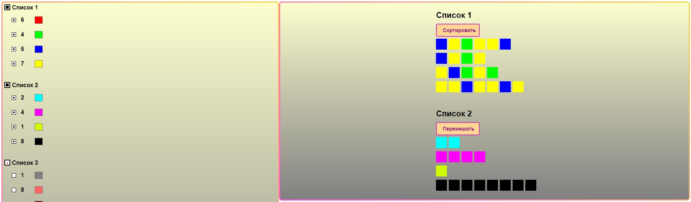

# list-with-items

:grapes: Link: https://list-with-items.netlify.app/
## :lemon: Что за приложение?
<strong>List-with-items</strong> - это приложение-список, состоящее из x5 Lists, в каждом из которых хранятся некие Items (х4 Items в каждом List).
## :watermelon: Что было использовано?
+ Vue.js
+ SCSS
+ Git / Netlify
## :mandarin: Структура
Приложение состоит из 3-ёх компонентов:
+ List
+ Item
+ RightPanel
## :pear: Особенности
+ Списки Lists можно сворачивать и разворачивать.
+ С помощью чекбокса List можно выбирать все Items внутри него сразу. Или выбирать конкретные Items, используя их индивидуальный чекбокс.
+ Если у List выбраны не все Items, то в чекбоксе у этого List будет стоять точка.
+ Можно менять количество Items (0=<).
+ Можно менять цвет каждого Items.
+ Если Items (или Lists) выбраны и их количество больше нуля, то они появятся в панели справа.
+ В правой панели, мы можем удалить любой Item, кликнув на него.
+ В правой панели, мы также можем перемешать Items конкретного List в случайном порядке. Повторное нажатие на кнопку рассортирует Items по порядку (в соответствии с их цветом).
